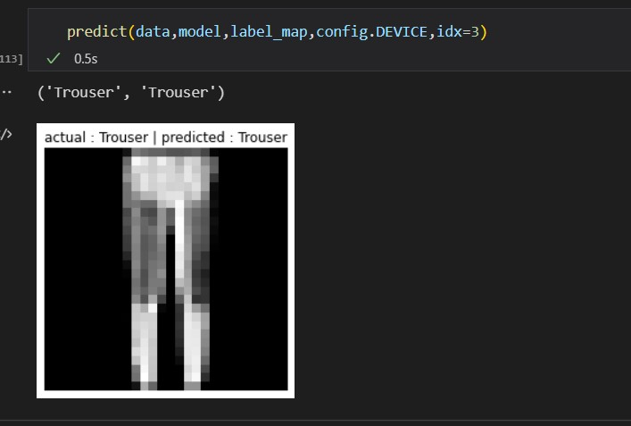

# Pytorch CNN Custom 
Here we have created a custom CNN pytorch network for Mnist dataset and working fine.

# How to Run
```bash
conda activate ./env
```
```bash
pip install -r requirements.txt
```

# How the Output Looks:
 <table>
  <tr>
    <td>Actual vs Predicted</td>
  </tr>
  <tr>
    <td></td>
  </tr>
 </table>

